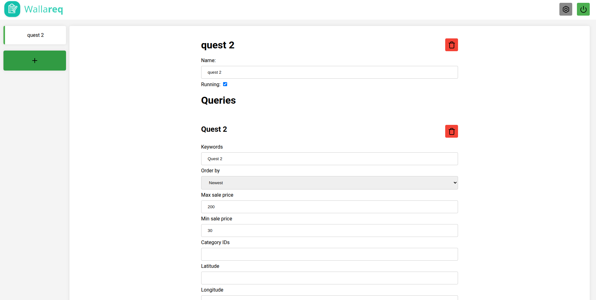
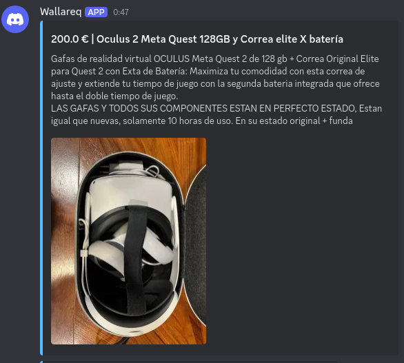

<br />
<div align="center">
  <a href="https://github.com/ThorTuwy/WallaReq">
    
  </a>

<h3 align="center">WallaReq</h3>

  <p align="center">
    Get all new products uploaded to Wallapop easier than ever.
  </p>
  
  
  <div style="text-align: center;">
    
    
  </div>
</div>

## About The Project
A web that use the API of wallapop to get all the new products in the platform, with a frontend to make using it as easy as possible. 
The backend is made with FastAPI and the frontend with SolidJS.

>[!CAUTION]
>This project is intented for selfthosting in local network, so everything is designed on the basis that it will only be accessed from a secure network, it is not advisable to make it accessible through the Internet.

## Getting Started

The recomended way to install this project is Docker.

### Docker

>[!TIP]
>If you know nothing about docker, you can check the [official guide](https://docs.docker.com/get-started/docker-overview/).

#### Pull
Get the latest image:
```sh
docker pull ghcr.io/thortuwy/wallareq:latest
```

#### Run
Run the docker:
```sh
docker run -p 8000:8000 ghcr.io/thortuwy/wallareq:latest
```

### Python+Node

#### Prerequisites

You need python3 and node installed on your system.

#### Clone the repository
```sh
git clone https://github.com/ThorTuwy/WallaReq
cd WallaReq
```
#### Run the start script
>[!WARNING]
>The script use pnpm to install and work with frontend dependencies, change it if you need it.
```sh
./start.sh
```

# Developers

## Prerequisites

You need python3 and node installed on your system.

Also for better code autocompletion is recommended to run "auto-code-generator" main.py script in order to get all templates and interface bouth for backend and frontend

## Run the project

For development I recomend to use the devstart.sh script:
>[!WARNING]
>The script use pnpm to install and work with frontend dependencies, change it if you need it.
```sh
./devstart.sh
```

## Build docker

I recommend before trying a pull request to build the docker to check if all is working properly:
```sh
./makeDocker.sh
```

## Roadmap

- [ ] Refactor code
- [ ] Improve easiness of adding new Notifications Methods (Mainly in the frontend side)
- [ ] Add new notifications methods
    - [X] Discord (Webhook)
    - [ ] Discord (Bot)
    - [ ] Telegram
    - [ ] ...

